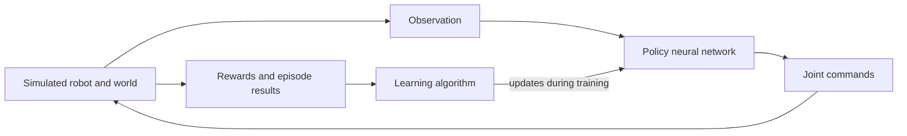
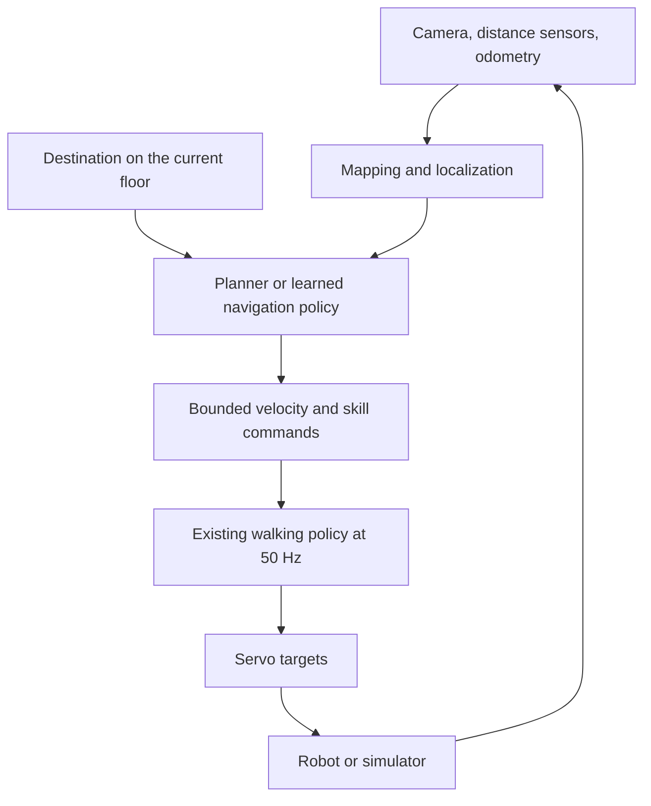

# Microduck RL Tutorial

**For the guided exercises, start with the
[VS Code workbook](RL_Workbooks/01_microduck_rl_tutorial/README.md).** It has one
lesson at a time, separate learning/execution-session instructions, and blank
`data_parameters.md` records. This document remains the longer reference.

A practical introduction to reinforcement learning, this training repository,
and the route from a walking duck to a duck that can navigate your home.

Written against `microduck_rl` commit `2b581c641406a48346e696212930ea881c222c52`
and simulator commit `e81974b932c7ca1819843b7bb3dcd42e2993e98e`, with official
documentation checked on **11 September 2026**. Examples were checked against
source; GPU training, scene playback, and hardware transfer were not run while
writing this guide. Sections labelled **proposed** describe work to implement.

## Reading route

For the hands-on workflow, follow the numbered steps in
[section 4](#4-your-first-training-and-playback-session). If you have already
finished the smoke test, go straight to
[Step 3: find its checkpoint and build the playback command](#step-3-find-the-saved-checkpoint-and-build-its-playback-command).
Sections 1–3 explain the background; sections 5–14 are reference material and
later exercises.

1. [Understand the learning loop](#1-what-reinforcement-learning-does).
2. [Meet the software stack](#2-the-software-stack).
3. [Understand the existing policy](#3-what-the-microduck-policy-knows).
4. [Run a first experiment](#4-your-first-training-and-playback-session).
5. [Find the relevant code](#5-how-the-training-code-is-organized).
6. [Change terrain](#6-changing-the-training-ground).
7. [Change goals and rewards](#7-setting-different-goals).
8. [Add parameters and observations](#8-adding-parameters-to-the-training-system).
9. [Turn your home into simulation assets](#9-mapping-a-room-or-house).
10. [Connect a house to training](#10-adding-the-house-to-training).
11. [Design a loadable-terrain app](#11-designing-your-own-loadable-terrain-app).
12. [Evaluate and debug](#12-evaluating-progress-and-debugging).
13. [Choose further tools and projects](#13-other-libraries-and-projects-to-explore).
14. [Follow a learning roadmap](#14-a-practical-learning-roadmap).

You can build your own application and custom environments without making them
part of upstream. This workspace's [roadmap](TODO.md) calls for custom projects
in their own repositories/submodules, sharing the existing robot and training
code where practical.

## 1. What reinforcement learning does

Imagine asking the robot to walk forward. Writing a controller by hand means
deciding how each joint should move as the body tips and feet contact the floor.
With **reinforcement learning (RL)**, you instead construct a simulated task,
give the robot information and available actions, and score the consequences.
A learning algorithm adjusts a controller to earn more reward over time.

The score must express what you want in measurable terms. “Walk nicely” is not
a specification. “Track the requested speed, stay upright, avoid slipping, and
avoid abrupt changes in joint commands” is a starting point.



### The vocabulary, using Microduck examples

| Term | Meaning here |
| --- | --- |
| Agent | The decision-making system controlling the duck. |
| Environment | The robot, physics, terrain, observations, rewards, resets, and task rules. |
| State | Everything the simulator knows: positions, velocities, contacts, and more. |
| Observation | The subset of information actually supplied to the controller. |
| Action | The controller's output; the existing gait produces 14 servo commands. |
| Policy | A function mapping observations to actions, usually a neural network. |
| Reward | A number scoring a transition or behavior. It is not a natural-language instruction. |
| Episode | One attempt, from reset until a task ending or time limit. |
| Rollout | A collected sequence of observations, actions, and rewards. |
| Return | Rewards accumulated over time, usually discounting distant rewards. |
| Checkpoint | Saved learning state, including network weights and often optimizer state. |
| Inference | Using a trained network to choose actions without updating its weights. |

The environment API commonly separates **termination** (such as a fall or
success) from **truncation** (such as reaching a time limit). Learning algorithms
handle the value of the state after these endings differently. Gymnasium is a
good place to learn this interface, although mjlab provides its own environment
and batched training machinery. [Gymnasium introduction](https://gymnasium.farama.org/introduction/basic_usage/)

### Training and running are different activities

During training, thousands of simulated ducks can try different movements.
During playback, the resulting policy simply computes actions. Driving the web
simulator does **not** teach its policy new skills. Changing its terrain changes
what the policy experiences, but its weights remain fixed.

There are also two different things you might train:

- **Locomotion:** turn a desired velocity into joint movements that keep the
  duck walking and balanced.
- **Navigation:** choose velocities or waypoints that lead to a destination
  while avoiding obstacles.

For home navigation, start with an existing locomotion policy and build the
navigation controller above it. This keeps learning to walk separate from
learning which doorway leads to the kitchen.

### PPO, actor, and critic

This repository uses **Proximal Policy Optimization (PPO)**. In simplified form:

1. Run the current policy in many environments and collect rollouts.
2. Estimate which actions led to better outcomes than expected.
3. Update the policy to favor those actions, limiting how aggressively the
   update changes action probabilities.
4. Collect fresh experience with the updated policy and repeat.

The **actor** chooses actions. The **critic** estimates expected future reward
and helps judge whether outcomes were better or worse than expected. The critic
is a training aid; the deployed walking controller needs the actor.

PPO is **on-policy**: it primarily learns from experience collected with the
current policy. A recording of an old run is useful for analysis, but is not
automatically a training dataset that ordinary PPO can keep reusing.
[Original PPO paper](https://arxiv.org/abs/1707.06347)

The actor explores during training by sampling actions. Evaluation usually uses
deterministic actions so you can judge the learned behavior consistently. A
large reward does not guarantee useful behavior: the policy can exploit mistakes
in how you score the task.

## 2. The software stack

You do not need to learn every library before your first experiment.

| Component | Its job | What you should learn first |
| --- | --- | --- |
| [MuJoCo](https://mujoco.readthedocs.io/en/stable/XMLreference.html) | Simulates rigid bodies, joints, actuators, contacts, and sensors. MJCF is its XML scene/model format. | Bodies, geoms, joints, coordinate frames, and collision geometry. |
| [MuJoCo Warp](https://github.com/google-deepmind/mujoco_warp) | Runs many physics worlds efficiently on NVIDIA GPUs. | Why batch size and collision complexity affect GPU memory. |
| [NVIDIA Warp](https://github.com/NVIDIA/warp) | GPU computing technology used beneath MuJoCo Warp. | Usually nothing initially; it is infrastructure. |
| [mjlab](https://mujocolab.github.io/mjlab/main/source/architecture_overview.html) | Assembles robot environments, sensors, task managers, and training integration. | Environment factories and their configuration objects. |
| [RSL-RL](https://github.com/leggedrobotics/rsl_rl) | Implements the learning algorithms and rollout/update machinery. | PPO settings and training logs. |
| [PyTorch](https://docs.pytorch.org/tutorials/beginner/basics/intro.html) | Neural networks, gradients, and tensors used by the policy and learning algorithm. | Tensor shapes, devices, and operations over many robots at once. |
| [BAM](https://github.com/Rhoban/bam) | Models servo behavior, including motor/friction effects that idealized actuators miss. | Why plausible motor simulation matters when transferring to hardware. |
| ONNX and [ONNX Runtime](https://onnxruntime.ai/docs/) | ONNX stores an exported network; ONNX Runtime executes it outside the training process. | Input/output contracts and observation normalization. |
| [Weights & Biases (`wandb`)](https://docs.wandb.ai/models/track/environment-variables) | Records experiments, metrics, and checkpoints. | Compare runs using the same evaluation conditions. |
| [uv](https://docs.astral.sh/uv/concepts/projects/sync/) | Manages Python, dependencies, environments, and commands. | `uv sync`, `uv run`, and the lockfile. |

The browser simulator adds MuJoCo WebAssembly, ONNX Runtime Web, Three.js, and
React. It is a separate playback application, not the GPU trainer. See its
[README](microduck-simulator/README.md).

### Versions matter

The checked-in [Python configuration](microduck_rl/pyproject.toml) requires
Python 3.12, pins `mjlab==1.3.0`, `warp-lang==1.12.0`, and `torch==2.9.1`, and
contains additional dependency overrides. The [lockfile](microduck_rl/uv.lock)
resolves MuJoCo 3.10.0 and MuJoCo Warp 3.8.1. These packages have independent
version numbers.

Use the pinned environment first. Current online documentation can describe APIs
newer than mjlab 1.3.0. Preserve the BAM source and dependency overrides when
creating a separate training project; copying only the top-level dependency
names is insufficient to reproduce this environment.

## 3. What the Microduck policy knows

The existing policy family shares **61 observation values and 14 actions at
50 Hz**: one policy decision every 20 milliseconds.

| Observation block | Values | Meaning |
| --- | ---: | --- |
| Angular velocity | 3 | How the body is rotating. |
| Projected gravity | 3 | Which direction is down, expressed in the robot's frame. |
| Joint positions | 14 | Servo positions relative to the expected reference convention. |
| Joint velocities | 14 | How fast those joints are moving. |
| Previous action | 14 | What the policy commanded on the preceding step. |
| Twist command | 3 | Requested forward/sideways velocity and yaw rate. |
| Head command | 4 | Requested offsets for neck pitch, head pitch, head yaw, and head roll. |
| Body command | 6 | Requested body position/orientation offsets. |
| **Total** | **61** | The ordered input vector expected by the current policy family. |

**Proprioception** means sensing your own body's state. The first 48 values are
proprioceptive/control-history information. The last 13 tell the policy what
movement or posture is requested. Command meanings can differ for special
skills, so identical dimensions alone do not establish compatibility.

The actor has **no camera image, obstacle map, absolute house position, or
terrain-height scan**. The velocity configuration explicitly removes the
default actor linear-velocity and terrain-scan observations. The critic can
receive extra simulator information, such as true linear velocity. This is
called **privileged information**: useful for training, unavailable to the
deployed actor. See the
[velocity configuration](microduck_rl/src/mjlab_microduck/tasks/microduck_velocity_env_cfg.py)
and [inference implementation](microduck_rl/scripts/infer_policy.py).

Consequences:

- It can learn to react to uneven ground through changes in its body state.
- It cannot anticipate a table or staircase by seeing it with inputs it lacks.
- Loading a house model does not tell it where the kitchen is.
- Adding camera or map inputs changes the policy interface and requires matching
  training, export, and runtime changes.

The 14 outputs command the actuated joints. Passive roller/backlash joints are
part of the physics but are not additional policy actions. Keep joint order,
reference pose, units, and action scaling consistent across implementations.

## 4. Your first training and playback session

Follow these steps in order. Each training command is followed by instructions
for finding its output and building the command that loads it. Sections 5 onward
are reference material and later exercises; you do not need them for this session.

**Your current place:** the five-iteration smoke run is already complete. Start
at **Step 3**, using the saved run shown there. You do not need to train it again.

### Step 1: Prepare the machine and choose logging

The workspace targets an NVIDIA RTX 3090 PC under WSL2. The Mac Mini is for
development and lighter tasks. The local smoke-run artifacts confirm that the
small training run completed; interactive playback remains to be checked.
[mjlab installation](https://mujocolab.github.io/mjlab/main/source/installation.html)

For a fresh WSL2 setup, follow NVIDIA's driver instructions: the Windows driver
supplies WSL GPU access; do not install a Linux display driver inside WSL.
[NVIDIA CUDA on WSL guide](https://docs.nvidia.com/cuda/wsl-user-guide/index.html)

From the workspace root, initialize the submodules if necessary:

```bash
git submodule update --init --recursive
cd microduck_rl
uv sync --locked
```

**All remaining commands run from `microduck_rl/`.** Keep the same terminal open
through the steps: the shell variables introduced below remember selected paths.
If you open a new terminal, enter `microduck_rl/` and set those variables again.

Check GPU visibility, task registration and tests:

```bash
nvidia-smi
uv run python -c 'import torch; print(torch.__version__, torch.version.cuda); print("CUDA available:", torch.cuda.is_available())'
uv run python -c 'import warp as wp; wp.init(); print(wp.get_devices())'
uv run list-envs
uv run --with pytest pytest tests/
```

Before training, choose logging. The default logger uses **Weights & Biases
(W&B)** to record experiments online. If you want that, authenticate once:

```bash
uv run wandb login
```

Alternatively, keep the logs local by setting this in your training terminal:

```bash
export WANDB_MODE=offline
```

Choose one route. Both save local checkpoints, and all required steps below use
local files. Offline runs do not have remotely accessible W&B results until
uploaded. To return to online mode in this terminal, use `unset WANDB_MODE` and
log in. [W&B offline-mode settings](https://docs.wandb.ai/models/track/environment-variables)

### Step 2: Run the five-iteration smoke test

A **run** is one training session. It saves **checkpoints**: snapshots of the
learned policy and training state. `train` learns; `play` loads a checkpoint to
show its behavior without further learning. Starting another `train` command
starts afresh unless you explicitly request resume.

Here is what the smoke-test settings mean, before you run them:

| Setting | Meaning |
| --- | --- |
| `--env.scene.num-envs 64` | Simulate 64 ducks in parallel, all contributing experience to one shared policy. |
| `--agent.max_iterations 5` | Collect experience and update the policy five times. Each iteration collects 24 steps per duck. |
| `--agent.run-name first-smoke` | Label the saved run. The label does not change training or select a previous checkpoint. |

At 50 Hz, 24 policy steps represent 0.48 simulated seconds per duck, not a
wall-clock duration. The physics timestep is 0.005 seconds, with four physics
steps per policy action. Keep that timing unchanged for these exercises.
[Pinned physics configuration](https://github.com/mujocolab/mjlab/blob/v1.3.0/src/mjlab/tasks/velocity/velocity_env_cfg.py)

The command will print `Logging experiment in directory:` followed by the
folder where its results are saved. Keep that line: it supplies the path for
the next step.

```bash
uv run train Mjlab-Velocity-Flat-MicroDuck \
  --env.scene.num-envs 64 \
  --agent.max_iterations 5 \
  --agent.run-name first-smoke
```

Wait for training to finish and the terminal prompt to return. This checks that
the physics and learning code run; five iterations will not teach a usable gait.
Check the reported rewards/losses for `nan` or `inf`, and resolve training errors
before increasing the workload.

### Step 3: Find the saved checkpoint and build its playback command

**This is what to do immediately after any `train` command.** First, find the
output line shaped like this:

```text
[INFO] Logging experiment in directory: /home/blm/dev/microduck_home/microduck_rl/logs/rsl_rl/velocity/2026-09-11_13-23-20_first-smoke
```

That is your completed smoke run's directory. If you ran training again, use the
new directory printed by that invocation. Each run gets its own timestamped
folder, even if you reuse `first-smoke` as the name.

If the terminal output is gone, list the saved runs with
`ls -1dt logs/rsl_rl/velocity/*/` and choose the timestamp/name for the training
session you want to inspect.

Store the directory in a shell variable named `duck_run`, then list its saved
checkpoints. The relative path below points to your existing smoke run; an
absolute path copied from the log works too. Omit the trailing `/` when setting
`duck_run`:

```bash
duck_run='logs/rsl_rl/velocity/2026-09-11_13-23-20_first-smoke'
ls -1v "$duck_run"/model_*.pt
```

For your smoke run, the output is:

```text
logs/rsl_rl/velocity/2026-09-11_13-23-20_first-smoke/model_0.pt
logs/rsl_rl/velocity/2026-09-11_13-23-20_first-smoke/model_4.pt
```

Choose the highest numbered checkpoint for the latest saved training state.
`ls -1v` sorts the numbers in order. The latest checkpoint is not necessarily the
best-performing one; it is simply the starting point for this first inspection.
Five iterations finish at `model_4.pt` because numbering starts at zero.

Set `duck_checkpoint` to that file and pass it to `play`:

```bash
uv run play Mjlab-Velocity-Flat-MicroDuck --checkpoint-file <PASTE MODEL PATH HERE>  --num-envs 1
```

The command is assembled from three things you now know:

| Part | Where it comes from |
| --- | --- |
| `Mjlab-Velocity-Flat-MicroDuck` | The same task ID used by `train`. |
| `--checkpoint-file "$duck_checkpoint"` | The actual `.pt` file you just listed in that run's output folder. |
| `--num-envs 1` | Show one simulated duck for inspection, regardless of the training batch size. |

**Expected result:** the viewer loads your saved policy and shows it acting.
Poor movement or falls are expected after five iterations. This check establishes
that the model can be loaded and displayed, not that walking has been learned.

With a working WSL display, `play` normally opens a native window. Otherwise it
uses a browser viewer and prints its address. To request the browser viewer
explicitly, append `--viewer viser` to the same command. Close the native viewer,
or press Ctrl+C in the terminal for browser playback, before continuing.

The same run folder also contains `params/agent.yaml`, `params/env.yaml`,
`events.out.tfevents.*` training metrics and, for your smoke run, an automatic
ONNX export. These are different outputs of the same training session.

You do not need `--wandb-run-path` for this local playback command. The optional
W&B alternative is explained after the numbered steps.

### Step 4: Export that checkpoint and replay the ONNX file

Keep `duck_checkpoint` pointing to the file selected in Step 3. The repository
exporter converts that checkpoint into an ONNX policy and includes observation
normalization, which is required for correct playback outside the trainer.
The exporter itself constructs a training environment, so use the working GPU
setup. This command creates `smoke-walking.onnx` in `microduck_rl/`:

```bash
uv run scripts/export.py Mjlab-Velocity-Flat-MicroDuck \
  --checkpoint-file "$duck_checkpoint" \
  --num-envs 1 \
  --onnx-file smoke-walking.onnx
```

After export finishes successfully, load the file it just created:

```bash
uv run scripts/infer_policy.py --walking smoke-walking.onnx --new-cmd-obs
```

This second viewer runs CPU MuJoCo and needs a working native display. The
`--new-cmd-obs` flag selects the current 61-value policy input format. Inspect
motion and try the controls printed in the terminal, then close the viewer.
Falling is still expected: exporting does not improve the five-iteration policy.

### Step 5: Practise resuming the smoke checkpoint

This step continues learning from the checkpoint selected in Step 3. It does not
start a fresh policy. Keep 64 environments and the same task for this rehearsal.
`--agent.load-run` takes only the run folder's name; `${duck_run##*/}` extracts
that name from your selected path. `${duck_checkpoint##*/}` similarly extracts
the checkpoint filename. The five iterations here are **five additional learning
iterations for this invocation**, not a request to stop at total iteration five.

```bash
uv run train Mjlab-Velocity-Flat-MicroDuck \
  --env.scene.num-envs 64 \
  --agent.resume True \
  --agent.load-run "${duck_run##*/}" \
  --agent.load-checkpoint "${duck_checkpoint##*/}" \
  --agent.max_iterations 5 \
  --agent.run-name smoke-resumed
```

Check that the output says it is loading your selected checkpoint. The resumed
training writes to a **new** timestamped `smoke-resumed` directory and leaves the
original smoke run intact. After it finishes, use its `Logging experiment in
directory:` line to list the new `.pt` files, as in Step 3. Use the actual filenames;
do not assume how the saved iteration number will be labelled after resume.

You have now rehearsed training, loading, export, CPU playback and resume with a
small workload. None of those checks establishes gait quality yet.

### Step 6: Choose a batch size using short training runs

Before longer training, check memory and speed at a larger environment count.
In a second WSL terminal, monitor the GPU while the run below is active:

```bash
nvidia-smi -l 1
```

Back in your original terminal, select a batch size and run another five-iteration
check. Start at 256, then try 1,024. Try 4,096 only if the smaller runs leave enough
memory. Set `duck_num_envs` to each candidate and rerun this block:

```bash
duck_num_envs=256
uv run train Mjlab-Velocity-Flat-MicroDuck \
  --env.scene.num-envs "$duck_num_envs" \
  --agent.max_iterations 5 \
  --agent.run-name "batch-check-$duck_num_envs"
```

For each run, note its printed output directory, highest observed GPU memory and
reported training throughput. Sampling memory once per second is approximate;
it can miss brief peaks. These short runs include startup effects and are only
an initial comparison. More environments collect more experience per iteration,
but also use more memory and change the learning batch size.

These are fresh test runs, not continuations of the smoke policy. Their saved
checkpoints can be loaded using the same directory → file → `play` procedure in
Step 3. They do not need a separate gait evaluation.

Choose a batch size that completed successfully with memory headroom. Leave
`duck_num_envs` set to that number for the next step. Stop the GPU monitor with
Ctrl+C when you no longer need it.

### Step 7: Choose the training duration and start a longer run

Before starting, decide how you will judge the gait: standing, forward motion,
both turn directions and stopping. Use the same command sequence and observation
duration when comparing checkpoints, and record falls and unwanted motion.

Choose **one** training budget:

| Iterations | Purpose |
| --- | --- |
| 1,000 | Optional early learning experiment: inspect progress before spending more GPU time. |
| 5,000 | Suggested first longer experiment, with time to train beyond the later curriculum stages. |
| 50,000 | The pinned walking configuration's default duration. It is neither a requirement nor a guarantee of a finished gait. |

This recipe strengthens movement smoothing through iteration 1,500 and increases
standing practice/head-command ranges through iteration 2,000. A 1,000-iteration
experiment ends before those schedules finish. You can skip that experiment and
choose 5,000 directly after your batch-size check.

The upstream quickstart selects 4,096 environments. You can retain a smaller
batch if that is what you validated in Step 6. The run below uses that selected
`duck_num_envs` value and starts a **fresh** walking policy:

```bash
uv run train Mjlab-Velocity-Flat-MicroDuck \
  --env.scene.num-envs "$duck_num_envs" \
  --agent.max_iterations 5000 \
  --agent.run-name flat-baseline
```

For the optional shorter experiment, change `5000` to `1000`. For the configured
default duration, use `50000`. Changing the run name only changes the label.
[Walking configuration](microduck_rl/src/mjlab_microduck/tasks/microduck_velocity_env_cfg.py),
[upstream quickstart](microduck_rl/README.md#quickstart).

### Step 8: Load and assess the longer run's output

Immediately after training finishes, repeat the same output-to-command procedure.
Copy this run's directory from `Logging experiment in directory:` into `duck_run`,
replacing the placeholder below, then list its checkpoints:

```bash
duck_run='PASTE_THE_DIRECTORY_PRINTED_BY_THIS_TRAINING_RUN'
ls -1v "$duck_run"/model_*.pt
```

Select the actual filename from that list. Replace `model_N.pt` below with it:

```bash
duck_checkpoint="$duck_run/model_N.pt"
uv run play Mjlab-Velocity-Flat-MicroDuck \
  --checkpoint-file "$duck_checkpoint" \
  --num-envs 1
```

Now evaluate the gait checks you chose in Step 7. Inspect command following,
falls and motion quality alongside the reward curves. Preserve the run's saved
settings, seed and checkpoint, and note training time, GPU memory and observations.

Export the selected longer-trained policy and check its CPU playback too:

```bash
uv run scripts/export.py Mjlab-Velocity-Flat-MicroDuck \
  --checkpoint-file "$duck_checkpoint" \
  --num-envs 1 \
  --onnx-file walking.onnx

uv run scripts/infer_policy.py --walking walking.onnx --new-cmd-obs
```

If it needs more training, resume **this selected checkpoint** with your validated
batch size. For example, this adds another 1,000 learning iterations:

```bash
uv run train Mjlab-Velocity-Flat-MicroDuck \
  --env.scene.num-envs "$duck_num_envs" \
  --agent.resume True \
  --agent.load-run "${duck_run##*/}" \
  --agent.load-checkpoint "${duck_checkpoint##*/}" \
  --agent.max_iterations 1000 \
  --agent.run-name flat-continued
```

After that command finishes, repeat Step 8 using the newly printed run directory.
Keep the same environment and policy interface when learning to resume. Changing
rewards or terrain is fine-tuning; changing observation dimensions or network
architecture can make an existing checkpoint incompatible.

### Optional: Load a checkpoint through W&B

This is an alternative to the local `--checkpoint-file` commands above, useful
when you want to retrieve a checkpoint uploaded to W&B.

`--wandb-run-path` expects `ACCOUNT_OR_TEAM/PROJECT/RUN_ID`. For your recorded
smoke run, the project is `mjlab_microduck` and the generated run ID is `dpomi0hl`.
`first-smoke` is your chosen label, not the W&B ID. Obtain the account/team from
the run URL printed by W&B during training:

```text
Run URL:  https://wandb.ai/ACCOUNT_OR_TEAM/mjlab_microduck/runs/dpomi0hl
Run path: ACCOUNT_OR_TEAM/mjlab_microduck/dpomi0hl
```

Replace `ACCOUNT_OR_TEAM` with the actual value from that URL before running:

```bash
uv run play Mjlab-Velocity-Flat-MicroDuck \
  --wandb-run-path ACCOUNT_OR_TEAM/mjlab_microduck/dpomi0hl \
  --num-envs 1
```

The `/runs/` part of the URL is omitted from the run path. If the run was offline
and has not been uploaded, continue using its local checkpoint instead.

### Optional: Move training to the cloud later

Cloud training uses `--hf-jobs`. Read the [local HF Jobs guide](microduck_rl/scripts/hf/README.md)
and inspect a `--dry-run` before submitting paid GPU work. A separate custom
package and its assets must be included in the remote environment; sibling
repositories on your PC are not automatically available there.

## 5. How the training code is organized

Most task changes do not require changing PPO itself.

| Location | What to change or investigate |
| --- | --- |
| [tasks/microduck_velocity_env_cfg.py](microduck_rl/src/mjlab_microduck/tasks/microduck_velocity_env_cfg.py) | Main walking recipe, terrain mix, observations, commands, randomization, rewards, and PPO settings. |
| [tasks/mdp.py](microduck_rl/src/mjlab_microduck/tasks/mdp.py) | Custom reward/observation/event/command/curriculum implementations. MDP means Markov decision process. |
| [tasks/__init__.py](microduck_rl/src/mjlab_microduck/tasks/__init__.py) | Registers task IDs used by `train`, `play`, and export. |
| [robot/microduck_constants.py](microduck_rl/src/mjlab_microduck/robot/microduck_constants.py) | Robot configurations, reference pose, and actuator setup. |
| [robot/microduck/](microduck_rl/src/mjlab_microduck/robot/microduck/) | MJCF robot models, scenes, meshes, and model-export configuration. |
| [actuator/friction_dr_bam.py](microduck_rl/src/mjlab_microduck/actuator/friction_dr_bam.py) | Servo friction randomization and backlash-aware feedback. |
| [tests/](microduck_rl/tests/) | Examples of checking task configuration and reward behavior. |
| [sim/body_server.py](microduck_rl/src/mjlab_microduck/sim/body_server.py) | A CPU MuJoCo robot body served to the separate robot runtime. |

In an environment factory, `cfg` holds several distinct systems:

| Configuration | Question it answers |
| --- | --- |
| `cfg.scene` | Which robot, terrain, and sensors exist? |
| `cfg.actions` | How do network outputs affect the robot? |
| `cfg.observations` | What can the actor and critic observe? |
| `cfg.commands` | What desired movement or target is sampled? |
| `cfg.rewards` | How is behavior scored? |
| `cfg.events` | What happens on initialization, reset, or periodically? |
| `cfg.terminations` | When does an attempt end? |
| `cfg.curriculum` | How does difficulty or a setting change during learning? |

The RL runner configuration controls the algorithm: learning rate, network size,
rollout length, and related settings. Read [the RL contributor guide](microduck_rl/AGENTS.md)
before creating a task; it records practical failure modes specific to this robot.

Some useful registered tasks are:

| Task ID | Purpose |
| --- | --- |
| `Mjlab-Velocity-Flat-MicroDuck` | Walking while tracking velocity/head commands. |
| `Mjlab-Velocity-Rough-MicroDuck` | Walking on the configured terrain mixture. |
| `Mjlab-VelStand-Flat-MicroDuck` | Combine walking and recovery behavior. |
| `Mjlab-StandUp-Flat-MicroDuck` | Recover to standing from varied starting poses. |
| `Mjlab-SitStand-Flat-MicroDuck` | Respond to a commanded sit/stand transition. |
| `Mjlab-GroundPick-Flat-MicroDuck` | A timed reaching motion toward the ground. |
| `Mjlab-Velocity-Flat-MicroDuck-Rollers` | Velocity tracking with the roller model. |

`uv run list-envs` is the authoritative list for your installed revision. A task
name describes what is being trained, not a guarantee that a particular checkpoint
has learned it successfully.

## 6. Changing the training ground

### First, select an existing terrain task

The registered rough-walking task is already available:

```bash
uv run train Mjlab-Velocity-Rough-MicroDuck \
  --env.scene.num-envs 64 \
  --agent.max_iterations 5 \
  --agent.run-name rough-smoke
```

Its `MICRODUCK_ROUGH_TERRAINS_CFG` currently mixes:

| Terrain | Configured weight | Height/slope range |
| --- | ---: | --- |
| Flat | 0.25 | Level ground. |
| Pyramid stairs | 0.25 | Step heights from 0 to 0.015 m. |
| Random grid | 0.30 | Height offsets from 0 to 0.010 m. |
| Pyramid slope | 0.20 | Rise/run from 0.03 to 0.10, approximately 1.7–5.7 degrees. |

These are **centimetre-scale** disturbances for a small robot. Household stairs
are a different task. `size=(8.0, 8.0)` describes a terrain patch, not the robot's
dimensions or the size of every observation.

mjlab can use box-based terrain or heightfields: a heightfield stores one ground
height for each horizontal sample. Geometry is generated when the scene is
constructed; selecting another patch on reset does not necessarily regenerate
the terrain. [mjlab terrain guide](https://mujocolab.github.io/mjlab/main/source/terrain.html)

The pinned generator defaults to random terrain allocation. For an explicitly
ordered terrain curriculum, set `curriculum=True` and configure the task's
terrain-level advancement. Do not assume that having several rows alone means
the run progresses from easy to hard.
[mjlab 1.3.0 generator](https://github.com/mujocolab/mjlab/blob/v1.3.0/src/mjlab/terrains/terrain_generator.py)

### Worked exercise: a gentler rough-ground task

**Proposed code to add in your development branch/fork; it is not installed by
this tutorial.** For this small exercise, create
`src/mjlab_microduck/tasks/microduck_home_practice_env_cfg.py` inside your RL copy:

```python
from copy import deepcopy

from mjlab_microduck.tasks.microduck_velocity_env_cfg import (
    MICRODUCK_ROUGH_TERRAINS_CFG,
    MicroduckRlCfg,
    make_microduck_velocity_env_cfg,
)


def make_home_practice_env_cfg(play: bool = False):
    # Keep upstream sensors, actuators, and rough-contact solver settings.
    cfg = deepcopy(make_microduck_velocity_env_cfg(play=play, rough=True))
    terrain = deepcopy(MICRODUCK_ROUGH_TERRAINS_CFG)
    terrain.seed = 42
    terrain.num_rows = 3
    terrain.num_cols = 4
    terrain.curriculum = False
    terrain.sub_terrains["pyramid_stairs"].step_height_range = (0.0, 0.005)
    terrain.sub_terrains["random_grid"].grid_height_range = (0.0, 0.003)
    terrain.sub_terrains["pyramid_slope"].slope_range = (0.01, 0.04)
    cfg.scene.terrain.terrain_generator = terrain
    cfg.scene.terrain.max_init_terrain_level = 0
    cfg.curriculum.pop("terrain_levels", None)
    return cfg


HomePracticeRlCfg = deepcopy(MicroduckRlCfg)
HomePracticeRlCfg.experiment_name = "home_practice"
HomePracticeRlCfg.run_name = "gentle_ground"
```

At the end of `src/mjlab_microduck/tasks/__init__.py`, add:

```python
from .microduck_home_practice_env_cfg import (
    HomePracticeRlCfg,
    make_home_practice_env_cfg,
)

register_mjlab_task(
    task_id="Mjlab-HomePractice-Rough-MicroDuck",
    env_cfg=make_home_practice_env_cfg(),
    play_env_cfg=make_home_practice_env_cfg(play=True),
    rl_cfg=HomePracticeRlCfg,
    runner_cls=MicroduckOnPolicyRunner,
)
```

The registry function and runner already exist in that module. Check that the
new ID appears in `uv run list-envs`, then run it with 64 environments and five
iterations. Use its new ID for training, playback, and export.

`deepcopy` prevents your edits from mutating a configuration shared with another
task. This example deliberately removes terrain-level advancement to isolate
geometry changes. It retains other upstream curricula. For evaluation, also
create a copy with a different terrain seed and test all terrain types; a fixed
seed is useful for comparisons, not evidence of generalization.

### Ramps, steps, and custom generators

The repository already contains a custom generator:
[FlatRampTerrainCfg](microduck_rl/src/mjlab_microduck/tasks/slope_terrain.py).
It creates a start platform, descending ramp, and runout, then returns their
geometry and a spawn origin. Its companion script can build or display terrain:

```bash
uv run scripts/view_slope_terrain.py --deg-min 2 --deg-max 6 --build-only
uv run scripts/view_slope_terrain.py --deg-min 2 --deg-max 6
```

This previews terrain, not a trained robot. The generator is used by a roller
task; its larger possible slopes are not established walking capabilities.

When designing a generator, use `difficulty` to vary one feature such as step
height, and the supplied random-number generator for reproducible variation.
Return a spawn origin on a valid surface. In tiled environments, reset positions
must include the tile origin; otherwise robots can start inside or below the
terrain. Check geometry before spending time on learning.

### Visual changes versus physical changes

A brown floor is not automatically carpet. Texture and color affect images;
friction, contact geometry, compliance, and actuator behavior affect movement.
The apartment's carpet/rug overlays are visual-only geoms in this checkout.
To investigate carpet-like behavior, explicitly model and vary the relevant
contact properties, then compare against measurements when hardware is available.

Likewise, editing an XML scene used by `infer_policy.py` does not automatically
change the scene assembled by a registered training task. Follow the relevant
environment factory's `cfg.scene` configuration.

## 7. Setting different goals

There are three levels of change:

| Desired change | Appropriate mechanism |
| --- | --- |
| Walk more slowly or turn left now | Send a different command to an existing policy. |
| Learn a gait that prioritizes different speeds or smoother motion | Change command sampling/rewards and train or fine-tune. |
| Go to a room, find an object, or explore an unknown floor | Add perception/localization and a navigation/task controller. |

### Change what is practiced

For example, inside your environment factory, before returning `cfg`:

```python
twist = cfg.commands["twist"]
twist.ranges.lin_vel_x = (-0.15, 0.25)  # metres per second
twist.ranges.lin_vel_y = (-0.10, 0.10)
twist.ranges.ang_vel_z = (-0.60, 0.60)  # radians per second
```

This changes the distribution of requested movement during training. It does
not directly set the robot's actual velocity. The policy still needs to learn
to track those commands. Include exact-zero commands and turn-in-place cases:
uniformly sampling a continuous range almost never produces an exactly zero
command vector. The existing task has explicit standing and turning buckets.

### Change how behavior is scored

For an initial controlled experiment, change one existing term:

```python
cfg.rewards["track_linear_velocity"].weight = 2.5
```

Then compare speed error, falls, and motion against the unchanged baseline.
Higher tracking weight can also encourage rough movement; reward terms compete.

If changing a term with a curriculum, update its schedule too. For example,
`action_rate_l2` starts at one weight and is changed by `action_rate_weight`.
Editing only the initial weight does not replace the later scheduled values.

**Check the sign of the function before assigning its weight.** Some functions
return positive costs and need negative weights. Others already return negative
penalties and need positive weights. A negative weight on a negative penalty
rewards the unwanted behavior. Test both a desirable and an undesirable state.

### Define a new skill

Choose a nearby template: standing/recovery for a balance task, sit/stand for a
commanded posture transition, or ground-pick for a timed reaching movement.
Write down five things before coding:

1. **Success:** an observable result, such as holding a pose for a duration.
2. **Information:** observations and command inputs that make the task solvable.
3. **Practice distribution:** starting poses, targets, disturbances, and resets.
4. **Reward:** progress toward the result plus physically relevant penalties.
5. **Endings:** success, failure, and time-limit conditions.

Implement custom terms following `tasks/mdp.py`, create a separate environment
factory, and register a distinct ID and experiment name. Verify a target pose
can physically settle under the actual actuator model before rewarding it.
For a difficult maneuver, start closer to completion and gradually expand the
starting states. This is a **curriculum**.

### Example specification: reach a doorway

This is a **proposed navigation task**, not an existing registered task:

| Part | Example definition |
| --- | --- |
| Observation | Goal direction/distance, nearby obstacle ranges, estimated motion, previous command, localization confidence. |
| Action | Bounded forward speed and yaw rate sent to the existing walking policy. |
| Reset | Sample connected, collision-free start/goal pairs on the same floor. |
| Success | Enter a 0.15 m target region and stop for 0.5 seconds; these are illustrative tolerances. |
| Reward | Progress along a feasible route, successful arrival, and penalties for collisions, falls, and unnecessary delay. |
| Failure | Fall, forbidden boundary crossing, or an unrecoverable state; timeout is tracked separately. |

Straight-line distance can mislead a policy in a maze: moving toward a wall may
reduce distance while making no useful progress. Consider distance along a
planned route. Reward arrival once or end the episode so repeatedly entering
the goal does not become an exploit. These design choices require a new task
implementation and measured comparisons.

## 8. Adding parameters to the training system

“Add a parameter” can mean several very different changes. Choose the category
before adding a number to a configuration file.

| Kind of parameter | Example | Does the actor's input need to change? |
| --- | --- | --- |
| Task setting | Episode duration, success radius, terrain height. | Usually no. |
| Reward setting | Weight, tolerance, or smoothing timescale. | No, unless it represents a goal the actor must distinguish. |
| Physics/randomization setting | Floor friction, payload mass, sensor delay. | Not necessarily; the actor may learn robustness without observing the setting directly. |
| Runtime command | Desired speed or requested head posture. | Only if it cannot use an existing, compatible command slot. |
| Observation | Obstacle ranges, battery measurement, or goal direction. | Yes if added to the actor; critic-only inputs are a separate case. |
| Learning hyperparameter | Learning rate, entropy weight, network size. | No sensor change, but architecture changes can invalidate checkpoints. |

### Configuration values and reward-function arguments

Existing settings are often simple assignments in your environment factory:

```python
cfg.episode_length_s = 12.0
cfg.events["foot_friction"].params["ranges"] = (0.7, 1.1)
```

These example values are experiments, not measured properties of your floor.
The friction event changes the robot's foot contact parameters; it does not
assign different materials to different rooms.

For a custom reward, define explicit arguments such as `target_height` or
`tolerance`, and pass them through `RewardTermCfg.params`. The function must
return one finite value per environment: a tensor shaped `(num_envs,)` on the
environment's device. Use tensor operations across the batch, rather than a
Python loop over thousands of robots. Follow an existing function and test its
values on controlled states before using it in training.

Changing `cfg` in the factory affects environment construction. To change a
setting during an active run, use the appropriate manager or curriculum: managers
can hold copies of the configuration, so editing `env.cfg` later may have no
effect. The existing `reward_weight` implementation shows this distinction.

### Randomization: practice the uncertainty you expect

**Domain randomization** trains across a distribution of plausible simulated
conditions so the policy is less dependent on one perfect model. This checkout
already varies several actuator, body, sensor, and disturbance settings.

For a home experiment, candidate variations include floor friction, small payload
changes, measurement noise, delayed commands, and slightly different furniture
positions. Start with narrow ranges and widen them after the basic task works.
Extreme randomization can make the task impossible rather than robust.

When adding an event, choose its timescale deliberately:

- **Startup:** a parameter fixed for the run, such as a calibration bias.
- **Reset:** a new floor condition or payload for each episode.
- **Interval:** a disturbance occurring occasionally while walking.

Restore reference values before applying custom randomization so changes do not
accumulate across resets. Under BAM, joint-friction variation belongs in the
actuator's `friction_scale`; changing a friction field that BAM zeros will not
have the intended effect. See
[friction_dr_bam.py](microduck_rl/src/mjlab_microduck/actuator/friction_dr_bam.py).

### Add a runtime goal without breaking the gait

The current 61-value contract already has velocity, head, and body commands.
Use those for their intended meanings. Do not quietly repurpose an unused slot
and expect another policy or application to interpret it correctly.

For navigation, a separate controller can observe a goal and produce the existing
twist command. This introduces new information at the navigation layer while
retaining the walking policy's interface.

If a brand-new low-level command is necessary, define its units and range,
sample it during training, expose it through observations, and make the reward
depend on the requested value. Merely appending an input does not teach the
network what to do with it.

### Add an observation deliberately

Suppose you want obstacle distance or battery state in a policy:

1. Define how the real robot will measure or estimate it.
2. Add a corresponding simulator sensor or observation function.
3. Specify shape, units, coordinate frame, normalization, and missing-data values.
4. Simulate noise, delay, and dropouts where relevant.
5. Add it to the intended observation group in a documented order.
6. Train a compatible network and update every observation builder at deployment.
7. Version the new policy interface and test export/inference end to end.

The current publisher validates `[1, 61] -> [1, 14]` networks. A new actor input
shape needs changes to that validation and to consumers, not just the trainer.
Adding privileged information only to the critic can preserve the actor interface,
but still changes the training configuration and may affect checkpoint loading.

Avoid giving a deployable actor perfect simulator position unless real
localization can supply its equivalent. A teacher policy may use privileged
information during training and later be distilled into a sensor-based student,
but that is an additional learning procedure.

### Learning settings worth understanding

The walking recipe currently sets these in `MicroduckRlCfg`:

| Setting | Current value | Interpretation |
| --- | ---: | --- |
| Actor/critic hidden layers | 512, 256, 128 | Capacity of the two neural networks. |
| Learning rate | 0.001, adaptive schedule | Scale of parameter updates; the schedule can adjust it. |
| PPO clipping parameter | 0.2 | Limits part of the policy-update objective. |
| Entropy coefficient | 0.01 | Encourages action exploration during training. |
| Discount `gamma` | 0.99 | Weight given to future rewards. |
| GAE `lam` | 0.95 | Controls a tradeoff in estimating action advantages. |
| Rollout steps per environment | 24 | Amount of fresh experience collected before an update. |
| Learning epochs / mini-batches | 5 / 4 | How each collected batch is processed. |

These are source defaults, not universal best values. Initially, change terrain,
commands, or one reward term while keeping PPO settings fixed. Otherwise it is
hard to identify why a result changed.

## 9. Mapping a room or house

### Four artifacts with different purposes

| Artifact | Contains | Used for |
| --- | --- | --- |
| Visual reconstruction | Textured surfaces or a point cloud. | Rendering and camera/perception experiments. |
| Collision model | Solid floors, walls, obstacles, and contact properties. | Physics: where the duck can stand, fall, or collide. |
| Navigation map | Free/occupied/unknown space, traversability, and destinations. | Localization, planning, and deciding where movement is allowed. |
| Training task | Observations, actions, goals, rewards, resets, and endings. | Defining what the policy learns in that world. |

A scan supplies evidence for building these artifacts. It does not automatically
produce all four, and loading one does not configure the others.

### Route A: start with measurements

For your first room, a tape measure or existing floor plan is enough. Record:

- Floor dimensions, wall thicknesses, and doorway widths.
- Furniture footprints and clearance underneath tables or shelves.
- Threshold heights, floor transitions, ramps, and drops.
- A common origin and axes, using metres throughout.
- Candidate start points, destinations, and areas to exclude.

Represent the floor and walls as boxes. Represent furniture using a few boxes
or cylinders, keeping relevant openings clear. A simple measured model can be
more useful for initial collision/navigation testing than a detailed noisy scan.

For example, this standalone MJCF geometry can represent an empty 4 m by 3 m
room. It has no robot, controller, or task yet:

```xml
<mujoco model="measured_room">
  <worldbody>
    <geom name="floor" type="box"
          pos="0 0 -0.025" size="2 1.5 0.025"/>
    <geom name="north_wall" type="box"
          pos="0 1.5 0.5" size="2 0.04 0.5"/>
    <geom name="south_wall" type="box"
          pos="0 -1.5 0.5" size="2 0.04 0.5"/>
    <geom name="west_wall" type="box"
          pos="-2 0 0.5" size="0.04 1.5 0.5"/>
    <geom name="east_wall" type="box"
          pos="2 0 0.5" size="0.04 1.5 0.5"/>
  </worldbody>
</mujoco>
```

For MJCF boxes, `size` contains **half-extents**. The floor above is 4 m long,
3 m wide, and 5 cm thick, with its top at `z=0`. Split a wall into segments to
make a doorway rather than putting a door texture on a solid wall. Confirm
dimensions and conventions in the [MJCF reference](https://mujoco.readthedocs.io/en/stable/XMLreference.html).

### Route B: depth scanning or photogrammetry

Use a depth-capable device or overlapping photographs if you want more accurate
geometry or appearance. **Photogrammetry** reconstructs geometry from multiple
views. COLMAP provides structure-from-motion and dense reconstruction tools;
Open3D provides point-cloud processing such as downsampling and segmentation.
[COLMAP tutorial](https://colmap.github.io/tutorial.html),
[Open3D point-cloud guide](https://www.open3d.org/docs/release/tutorial/geometry/pointcloud.html)

A practical processing sequence is:

1. Capture overlapping views, including low obstacles and doorway edges.
2. Reconstruct the scene, then establish metric scale using known measurements.
3. Align the floor with `z=0`; retain the transform from scan coordinates.
4. Remove people, capture artifacts, floating points, and duplicated surfaces.
5. Derive simplified collision geometry and an independently detailed visual model.
6. Measure a few reconstructed distances against the room before proceeding.

Reflective surfaces, plain walls, and hidden furniture legs may reconstruct
poorly. Inspect the result from the robot's height. A chair seat visible from
above does not tell you whether the duck can walk between its legs.

**Do not use one giant room mesh as a solid collider.** Ordinary MuJoCo mesh
collision uses convex hulls: a concave room represented by one mesh can behave
like a filled solid. Use separate primitive colliders or a decomposition into
convex pieces. A heightfield is suitable for ground elevation but cannot represent
several surfaces above the same point, such as a tabletop over a floor.
[MuJoCo mesh collision rules](https://mujoco.readthedocs.io/en/stable/XMLreference.html#asset-mesh)

### Route C: let the robot map as it moves

**SLAM** means simultaneous localization and mapping: estimating both a map and
the robot's position while moving. **Localization** alone estimates position in
a map that already exists. **Odometry** estimates motion incrementally and tends
to drift; loop closure can correct drift when the system recognizes a revisited
place.

The Microduck-specific
[microduck_maploc_rs](https://github.com/apirrone/microduck_maploc_rs) project
documents ToF-based mapping, saved-map relocalization, A* planning, and a waypoint
follower producing body velocities. This makes it a relevant integration lead,
not a dependency already installed in this workspace. Sensor and runtime wiring
must match your versions.

ToF means **time of flight**, a method of estimating distance from light travel
time. The simulator's [ToF model](microduck_rl/src/mjlab_microduck/sim/tof.py)
produces an 8 by 8 grid of distances and validity statuses. Its rays move with
the head. Turning the head while incorrectly treating the sensor as body-fixed
would distort the resulting map.
This ray-based sensor model is an approximation; matching its array shape does
not reproduce every real sensor failure caused by surfaces, lighting, or occlusion.

An occupancy map is an estimate, not exact collision geometry. It may need
manual cleanup or conversion into wall segments for a physics scene, and it
will not recover all floor heights or furniture geometry. Preserve unknown areas
as unknown rather than assuming they are safe, empty space.

### Keep one dataset per floor

This is a **proposed layout** for a future custom submodule:

```text
microduck_home_envs/
  pyproject.toml
  src/microduck_home_envs/
    tasks/
    terrain/
    navigation/
  assets/floors/ground/
    scene.xml
    collision/
    visual/
    occupancy.png
    map.yaml
    starts_goals.json
    metadata.json
  assets/floors/upstairs/
  tests/
  evaluations/
```

Choose and document your own map/metadata schema. Include units, axis convention,
map resolution and origin, asset revision, and the transform between map and
simulator coordinates. Keep stair/drop boundaries explicit. Separate floor
datasets can share one gait and one navigation algorithm; they do not require
retraining the entire robot independently.

## 10. Adding the house to training

### First inspect the scenes that already exist

The checked-out RL repository includes:

- [scene_apartment.xml](microduck_rl/src/mjlab_microduck/robot/microduck/scene_apartment.xml)
  and [apartment.xml](microduck_rl/src/mjlab_microduck/robot/microduck/apartment.xml):
  a furnished, multi-room scene, including a floor opening and descending steps.
- [scene_vslam.xml](microduck_rl/src/mjlab_microduck/robot/microduck/scene_vslam.xml)
  and [vslam_room.xml](microduck_rl/src/mjlab_microduck/robot/microduck/vslam_room.xml):
  an open scene with visual features for localization experiments.

Try your exported walking policy in the apartment:

```bash
uv run scripts/infer_policy.py \
  --walking walking.onnx --new-cmd-obs \
  --scene src/mjlab_microduck/robot/microduck/scene_apartment.xml
```

This is playback with different scenery. It does not create an apartment-trained
policy or automatically enable obstacle avoidance. The apartment includes
10 cm descending steps, much larger than the walking task's 1.5 cm training
steps. Treat the opening and stairs as excluded areas initially.

For testing the separate robot runtime against a simulated body:

```bash
uv run duck-body \
  --scene src/mjlab_microduck/robot/microduck/scene_apartment.xml \
  --cameras a
```

The body server exposes simulated joints/sensors, with optional camera frames.
It expects a compatible `robotd` from the separate Microduck runtime, typically
connected with `robotd --sim 127.0.0.1:7801`. That binary and any camera/mapping
services are additional setup; starting the body server alone does not run a
navigation policy. See its [implementation](microduck_rl/src/mjlab_microduck/sim/body_server.py).

### A concrete bridge into mjlab: a measured-room terrain

The MJCF playback scene is not automatically used by `train`. A practical route
for simple measured rooms is a custom `SubTerrainCfg`, following the existing
ramp generator. **This is proposed example code**, suitable for a new
`measured_room_terrain.py` module in your custom task package:

```python
from dataclasses import dataclass

import mujoco
import numpy as np
from mjlab.terrains.terrain_generator import (
    SubTerrainCfg,
    TerrainGeometry,
    TerrainOutput,
)


@dataclass(kw_only=True)
class MeasuredRoomTerrainCfg(SubTerrainCfg):
    wall_height: float = 1.0
    wall_thickness: float = 0.08

    def function(self, difficulty, spec, rng) -> TerrainOutput:
        # Geometry uses tile-local coordinates from (0, 0) to (width, depth).
        width, depth = self.size
        t, h = self.wall_thickness, self.wall_height
        body = spec.body("terrain")
        geometries = []

        def box(position, half_size):
            geom = body.add_geom(
                type=mujoco.mjtGeom.mjGEOM_BOX,
                pos=position,
                size=half_size,
            )
            geometries.append(TerrainGeometry(geom=geom))

        box((width / 2, depth / 2, -0.025), (width / 2, depth / 2, 0.025))
        box((width / 2, t / 2, h / 2), (width / 2, t / 2, h / 2))
        box((width / 2, depth - t / 2, h / 2), (width / 2, t / 2, h / 2))
        box((t / 2, depth / 2, h / 2), (t / 2, depth / 2, h / 2))
        box((width - t / 2, depth / 2, h / 2), (t / 2, depth / 2, h / 2))

        return TerrainOutput(
            origin=np.array([width / 2, depth / 2, 0.0]),
            geometries=geometries,
        )
```

It returns five collision boxes and the floor's spawn origin, not a root-body
height. The generator handles placement within the terrain grid. In a custom
environment factory, after building an appropriate base configuration, use:

```python
from mjlab.terrains.terrain_generator import TerrainGeneratorCfg
from .measured_room_terrain import MeasuredRoomTerrainCfg

# This fragment belongs inside your factory, where cfg already exists.
cfg.scene.terrain.terrain_type = "generator"
cfg.scene.terrain.terrain_generator = TerrainGeneratorCfg(
    size=(4.0, 3.0),
    num_rows=1,
    num_cols=1,
    curriculum=False,
    seed=42,
    sub_terrains={"room": MeasuredRoomTerrainCfg()},
)
cfg.scene.terrain.max_init_terrain_level = 0
cfg.curriculum.pop("terrain_levels", None)
```

Register the resulting factory with a separate task ID, as in the gentler-ground
exercise. This makes a room loadable by mjlab, but **the inherited walking reward
still teaches velocity tracking**. It does not become a goal-reaching task until
you implement the observations, commands/actions, rewards, and resets for one.

This minimal geometry ignores `difficulty` and `rng`; later use them to vary
dimensions, door locations, or furniture. Before many parallel environments,
test a single robot and inspect collision masks, terrain origins, and clear
spawn locations. The room is deliberately enclosed; add a real opening before
asking a policy to leave it.

For detailed imported scenes, build a proper mjlab scene/entity integration
instead of assuming a `train --scene house.xml` flag exists. Reuse the scenery
without importing a second robot, preserve asset paths, and provide batched
spawn/goal handling. `cfg.scene.spec_fn` can modify the assembled MuJoCo spec,
but adding world geometry through a callback does not automatically arrange a
copy at every environment origin.

The walking robot uses a reduced collision model. House evaluation should check
head/body collisions with furniture using an appropriate fuller robot model;
switching only the XML without the matching EntityCfg, collision rules, and
sensor selectors is incomplete. Floor-contact sensors must recognize your new
floor, while navigation collision logic must distinguish walls from support
surfaces. Reuse and test the existing robot configuration machinery.

### Then build navigation above the gait

The following architecture is a **proposal for this workspace**:



Start with a classical planner and waypoint follower. It gives you a baseline
for testing maps, localization, door clearance, and the walking controller.
Later replace or augment that navigation layer with RL and compare its results.

For a learned navigation environment, one navigation action might last 0.1 s:
hold its requested velocity while the walking policy takes five 50 Hz decisions.
This is an illustrative starting rate to measure, not an existing project
default. The high-level environment must accumulate results over those steps,
detect falls immediately, and reset the entire controller state correctly.

A useful progression is:

1. One room, simulator position available, simple reachable destinations.
2. Add furniture, doorway goals, and collision penalties.
3. Replace perfect position with simulated localization and noisy sensor inputs.
4. Add multiple rooms, blocked passages, and recovery/replanning.
5. Evaluate different furniture layouts and goals held out from training.

Never confuse several independent training worlds with several ducks sharing
one physical room. Batched training usually uses independent worlds; the
`duck-body --ducks` feature intentionally creates interacting robots in a shared
world. These are different experiments.

### Integrate a separate custom package

The gentler-ground exercise can live in an RL fork. For the longer-term house
project, put your factories and assets in their own submodule. mjlab discovers
task packages through the `mjlab.tasks` entry-point group, as this repository
already demonstrates in its `pyproject.toml`:

```toml
# Fragment for your future custom package's pyproject.toml.
[project.entry-points."mjlab.tasks"]
microduck_home_envs = "microduck_home_envs.tasks"
```

This fragment is not a complete package definition. Package the module, declare
the pinned training dependencies, make the Microduck package available, and
register your factories from `microduck_home_envs.tasks`. Install it in the same
environment as the trainer. Verify discovery with `uv run list-envs`; test
installation from a fresh lockfile/environment so local imports do not hide
missing dependencies or assets.

## 11. Designing your own loadable-terrain app

You can use a common scene description for both training and browser playback.
The **proposed design** is a versioned terrain bundle containing:

- Units and coordinate conventions, scene ID, and asset checksums.
- Collision primitives and heightfields.
- Optional visual meshes/textures.
- Spawn points, named destinations, and forbidden regions.
- A robot/policy compatibility declaration.

For example, author box dimensions as full lengths in the bundle, then convert
to half-extents when generating MJCF. Have one loader create MuJoCo geometry
and another create the matching Three.js visuals. Centralize the coordinate
conversion: the existing browser maps MuJoCo `(x, y, z)` to Three.js `(x, z, -y)`.

The current browser core's
[buildPhysicsXml implementation](microduck-simulator/app/src/game/game.js)
injects its floor, terrain, walls, and props. It also builds the rendering rig
separately. Its prototype relief toggle already changes a shared height function
for physics and rendering. That is a useful example of keeping both surfaces
consistent, but not a general-purpose scene importer.

Start with a few bundled scenes and a selection menu. When changing scene,
reload or rebuild the physics model and rendering state, reset policy history,
and place the robot at a valid spawn. Loading arbitrary assets and switching
while walking are later features.

For matching playback, preserve more than ONNX dimensions:

- Observation ordering, units, reference frame, and normalization.
- Servo selection/order, reference pose, and action scaling.
- Control frequency, delay/filter behavior, and actuator dynamics.
- Collision shapes and physical surface properties.

The Python training stack explicitly uses BAM actuators. A browser using the
same network and a different actuator implementation can still behave
differently; assess that difference through matching rollouts. A realistic-looking
scene alone does not establish simulation equivalence.

## 12. Evaluating progress and debugging

### Define success independently of the reward

For walking, measure actual command-tracking error, fall rate, slips, and motion
quality. For navigation, measure arrival rate, collision rate, falls, path length,
completion time, and localization failures. For a pose skill, measure the target
error and how often it returns to a stable stance.

Use fixed evaluation episodes for fair comparisons, additional unseen episodes
for generalization, and several training seeds before declaring a change better.
Plot individual reward terms as well as total reward; the total can rise because
the robot discovered how to earn easy bonuses while neglecting its main task.
[SB3 evaluation advice](https://stable-baselines3.readthedocs.io/en/master/guide/rl_tips.html)

The W&B `Episode_Reward/<term>` values in this project are weighted contributions.
A term with zero weight will log zero even when the underlying physical quantity
changes. Watch actual rollouts too: a reward curve does not reveal a robot
scraping its head along the floor.

Record each experiment's task ID, source commit, changed configuration, dependency
lockfile, seed, terrain revision, environment count, checkpoint, and evaluation
results. Include elapsed time and peak GPU memory so you can plan the next run.

### Common problems

| Symptom | First things to investigate |
| --- | --- |
| The robot learns to stand still | Task commands too difficult, motion penalties too strong, or standing earns most of the reward. |
| It learns a violent shortcut | Reward permits it; check impacts, gates, and whether the target is physically attainable. |
| It walks in one viewer but fails after export | Missing normalization, wrong command format, action order/scale, timing, or actuator differences. |
| It spawns below the floor | Terrain origin, root reset height, coordinate conversion, or mesh scale. |
| A wall is visible but can be crossed | Visual-only geometry, collision masks, or a missing collider. |
| A visible doorway is blocked | Collider spans the opening or a concave mesh became a convex hull. |
| Rewards suddenly become NaN | Invalid observations, unstable contacts, bad reset states, or insufficient simulation buffers. |
| Increasing map detail causes GPU OOM | Too many collision geoms, contacts, cameras, or parallel environments. |
| Changing a parameter has no effect | Curriculum overwrites it, a manager copied it, the wrong task is registered, or the edited scene is playback-only. |
| Navigation works only with perfect pose | The actor learned to rely on information unavailable from the deployed localization system. |

`NaN` means “not a number,” typically produced by invalid numerical computation.
Do not fix persistent physics instability just by discarding bad rewards. Examine
the source of unstable states and use the repository's NaN guards as diagnostics.

### A useful validation order

1. **Configuration tests:** task registration, dimensions, correct model selection,
   reward signs, and valid parameter ranges.
2. **Geometry tests:** compile the model, inspect spawn positions and contacts,
   and settle the robot under the intended actuator model.
3. **Five-iteration smoke test:** finite observations/actions/rewards and stable stepping.
4. **Bounded learning run:** establish whether useful behavior begins to emerge.
5. **Held-out evaluation:** new starts, goals, disturbances, and floor arrangements.
6. **Export and CPU replay:** test the actual artifact you intend to deploy.
7. **Hardware transfer:** begin in a clear, controlled area with a reliable stop
   mechanism, then expand the evaluated conditions.

Tests in [tests/test_slope_terrain.py](microduck_rl/tests/test_slope_terrain.py)
illustrate checking geometry and spawn heights. The `test_*_cfg.py` files show
how to check task wiring without launching a long training run.

For a new house scene, include specific cases for door clearance, small
thresholds, sensor occlusion, blocked routes, and localization loss. Stair
traversal and moving between house floors need an explicit solution; treat them
as separate capabilities rather than assuming rough-ground walking covers them.

## 13. Other libraries and projects to explore

These are optional learning or integration choices, not additions to the pinned
training environment. Learn a tool when it answers a concrete question.

| Tool/project | Why it may be useful | Boundary to keep in mind |
| --- | --- | --- |
| [Gymnasium](https://gymnasium.farama.org/introduction/basic_usage/) | Learn observations/actions/resets using CartPole or another small environment. | Provides environment interfaces; it does not itself supply PPO training. |
| [Stable Baselines3](https://stable-baselines3.readthedocs.io/en/master/guide/rl_tips.html) | Convenient implementations for introductory PPO experiments and independent navigation prototypes. | It is not the learning backend used by this checkout; integration requires an appropriate environment adapter. |
| [CleanRL](https://docs.cleanrl.dev/) | Read compact algorithm implementations when you want to understand the PPO update itself. | A learning reference, not a Microduck-specific controller. |
| [mjlab Cartpole tutorial](https://mujocolab.github.io/mjlab/main/source/tutorials/cartpole.html) | Learn the same task-manager architecture on a simpler robot. | Use examples compatible with your pinned mjlab release. |
| [Isaac Lab](https://isaac-sim.github.io/IsaacLab/main/index.html) | Explore a broader robot-learning/simulation ecosystem and sensor-rich tasks. | Porting the robot, actuators, and task semantics is a substantial project. |
| [Open3D](https://www.open3d.org/docs/release/tutorial/geometry/pointcloud.html) | Process room scans and extract useful geometry. | Scan processing does not automatically create good contact physics. |
| [COLMAP](https://colmap.github.io/tutorial.html) | Reconstruct geometry from overlapping photographs. | Metric scale, cleanup, and collider creation remain part of the workflow. |
| [RTAB-Map](https://github.com/introlab/rtabmap) | Investigate mapping and localization with cameras/depth sensors. | Check your sensor data and calibration against the supported integration path. |
| [ROS 2 Nav2](https://github.com/ros-navigation/navigation2) | Reuse navigation infrastructure, planners, and controllers. | Needs robot interfaces, transforms, odometry, and sensor integration; not a drop-in Microduck package. |
| [microduck_maploc_rs](https://github.com/apirrone/microduck_maploc_rs) | A directly relevant mapping/localization/planning implementation for Microduck. | Verify runtime/protocol compatibility and actual behavior in your simulator. |

Related concepts worth learning later:

- **Imitation learning:** initialize behavior from demonstrations or a teacher
  policy, then potentially refine it with RL.
- **System identification:** measure real motor/contact behavior to improve the
  simulator; particularly relevant to BAM and this small robot's servos.
- **Hierarchical control:** let one controller choose goals or skills and another
  handle fast balance and joint movement.
- **Partial observability and memory:** a single sensor reading may not reveal
  motion or hidden obstacles; observation history or recurrent networks can help,
  at the cost of additional state/reset/export requirements.
- **Ablation studies:** remove one feature at a time to find out whether it is
  responsible for an improvement.

This workspace also contains a broader
[Microduck project survey](docs/MICRODUCK_PROJECTS.md). Its community-project
assessments are dated observations; check current source before adopting one.
An ONNX file or attractive demonstration is not by itself evidence of robust
household navigation or transfer to your hardware.

## 14. A practical learning roadmap

| Stage | Exercise | Evidence that you can move on |
| --- | --- | --- |
| 1 | Follow Gymnasium's basic loop and run a small PPO tutorial in a separate environment. | Explain observation, action, reward, reset, and training versus inference in your own words. |
| 2 | Run an existing Microduck walking policy. | Drive it, inspect its input format, and identify which scene/robot model is loaded. |
| 3 | Reproduce a small training run and export it. | Saved configuration/checkpoint, finite training, and playback of your exported ONNX. |
| 4 | Run the gentler-ground exercise. | Demonstrate that geometry changed and compare the same evaluation cases. |
| 5 | Change one command range or reward weight. | Explain the resulting behavioral difference using metrics and video. |
| 6 | Measure and model one room. | Correct dimensions, working collisions, and valid start/goal locations. |
| 7 | Add localization and a classical navigation baseline. | Reach several destinations and handle an obstructed route. |
| 8 | Train a navigation policy above the existing gait. | Compare success, collisions, and time against the baseline on held-out cases. |
| 9 | Add more floors and a loadable-scene application. | Reproducible scene selection with compatible physics, rendering, and controller state. |

For your first substantial project, build **one measured room, one reliable
walking policy, and a controller that reaches a few selected points**. That
exercise will expose the interfaces you need for a house simulator while keeping
the learning problem small enough to understand.
