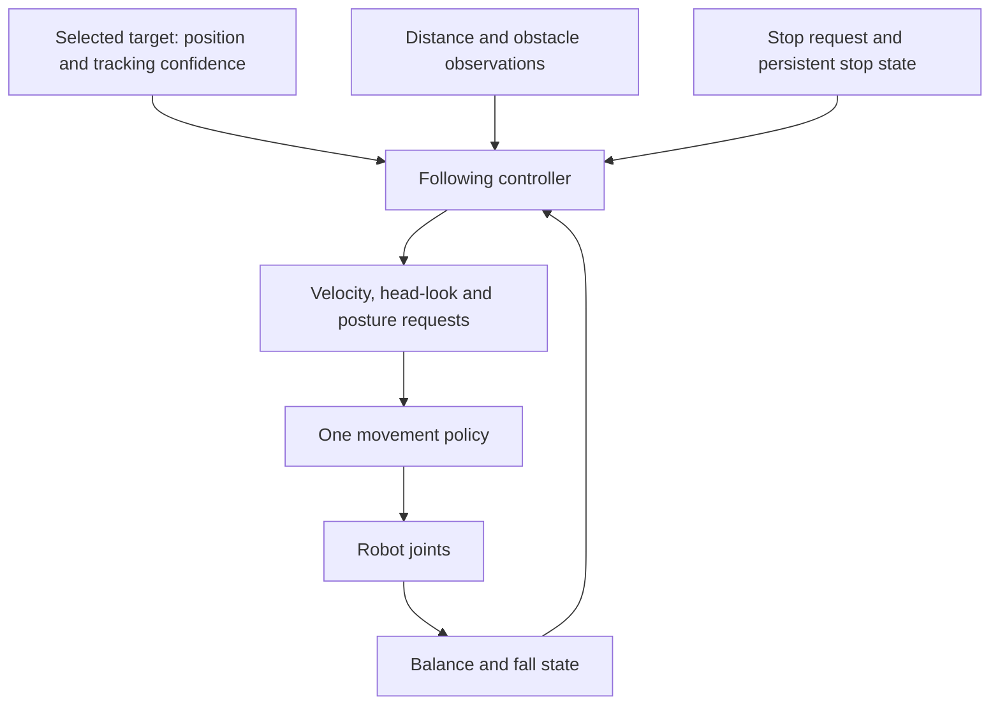

# From a walking checkpoint to a companion that follows people

[Reference index](README.md) · [Environment guide](environment_guide.md) · [Current experiment](../../RL_Workbooks/10_experiments/backlash_velocity_flat_unified_policy/instructions.md) · [Project roadmap](../../TODO.md)

Planning baseline: 17 September 2026, inspected `microduck_rl` commit
`2b581c641406a48346e696212930ea881c222c52`. This is our implementation plan,
separate from the historical upstream translations. Completed documentation is
not evidence that the proposed application already works.

## 1. Learn from the run already started

The user reports starting `Mjlab-VelStand-Flat-Backlash-MicroDuck`, 4,096
environments, 50,000 requested iterations, TensorBoard logging, run name
`experiment-backlash-flat-velstand-baseline`. Completion, actual throughput,
checkpoint paths and behaviour remain to be recorded in the execution session.

This recipe already trains walking and fall recovery in one actor. It gives us
something concrete to inspect before adding another skill. Its milestones are
training opportunities, not guarantees: reaching the recovery curriculum does
not establish successful recovery.

Start with the [checkpoint review](../../RL_Workbooks/10_experiments/backlash_velocity_flat_unified_policy/checkpoint_review/instructions.md).
Keep separate scores for walking, stopping, recovery and head movement. Select a
useful checkpoint from behaviour, then use the
[continuation lesson](../../RL_Workbooks/10_experiments/backlash_velocity_flat_unified_policy/continue_training/instructions.md)
to decide whether another bounded run is justified.

## 2. Make checkpoint comparisons repeatable

**Next implementation deliverable:** an evaluator in the future custom project,
with a VS Code editable scenario file and a report per checkpoint. Keep the
first browser observations; label them exploratory until conditions are fixed.

The evaluator must load the matching task and checkpoint, freeze evaluation
settings independently of the checkpoint's training progress, then use the same
scenario list and seeds for every candidate. It must:

- Use the ground-contact backlash robot, matching encoder observations and BAM
  actuation. Keep observation normalisation and the 61-input/14-output contract.
- Explicitly set command sequences, head/body commands, episode lengths, reset
  states and disturbances. Provide separate quiet and disturbance scenarios.
- Apply configuration through the active managers and prevent curricula from
  overwriting fixed test settings at reset. Test this with an early and a late
  checkpoint; their evaluation conditions must be identical.
- Support standing, measured face-down/face-up poses and named side poses with
  non-penetrating placement on this model. Record seeds and actual starts.
- Distinguish a learned recovery from an automatic reset. Capture termination
  reasons, falls, recovery time, upright hold time and tracking error.
- Record source revision, dependency versions, checkpoint identity, scenario
  version, commands, seeds and all overrides alongside CSV/JSON results and
  short recordings. Export the selected policy with its provenance.

Proposed first acceptance battery, to calibrate on this robot before adoption:

| Scenario | Proposed criterion |
| --- | --- |
| Stand at zero command | 30 uninterrupted simulated seconds, no fall; measure drift against an agreed distance limit. |
| Forward/backward and both turns | Five trials per direction; correct response and no falls at the recorded low command values. |
| Stop after walking | Translation settles within 2 seconds and remains stopped for 5 seconds; choose a measured velocity threshold. |
| Face-down / face-up recovery | Five trials of each; stable standing within 8 seconds, followed by a 5-second upright hold. |
| Side recovery | Separate left/right results; unsupported cases remain visible. |
| Look while standing/walking | Repeat the walking checks while varying head requests across the tested range. |

The evaluator must extend the episode timeout when a scenario needs more than
the stock 20 seconds. A timed reset cannot count as completing a 30-second hold.
Use fresh held-out seeds after tuning, and retain all attempts rather than only
successful videos. Five trials are an initial screen, not a hardware reliability
claim.

## 3. Add sitting to the same learned policy

Keep the user's requirement: **one learned movement policy** for walking,
sitting/standing and getting up after a fall. An application can choose requests;
all joint actions for those skills still come from the same actor.

The [unified task specification](../../RL_Workbooks/10_experiments/backlash_velocity_flat_unified_policy/unified_task_spec.md)
is the implementation brief. Create the custom environment/application in its
own repository and add it as a submodule when that implementation begins.

Use VelStand as the walking/recovery foundation. Borrow SitStand's posture and
transition ideas, but give the combined task a consistent posture command:
SitStand currently uses the forward-velocity slot as a sit flag. Its network
cannot simply be merged with a walking checkpoint.

Calibrate seated and standing poses on the chosen robot. Make rewards and
termination rules posture-aware so intended sitting is not treated as failed
recovery. Preserve walking and recovery experience while adding sitting, and run
the same regression battery at every stage. A warm start from a VelStand
checkpoint is an experiment that needs explicit compatibility and state-loading
checks; keep a fresh-training comparison where practical.

## 4. Build following using known simulated targets first

Start with a labelled moving target. This lets us test motion decisions before
having to diagnose perception mistakes at the same time.

Define a deliberate start action, target retention rules, desired distance and
speed limits. These are still choices to record, not assumed decisions. Losing
the target, blocked motion or a fall cancels travel. Recovery requests keep the
same actor active; finishing recovery does not silently restart following.

The agreed flat-palm stop can come from the selected person or a bystander. Stop
remains latched until deliberate restart. It cancels travel and new expressive
actions while allowing balance and an active posture/recovery transition to
settle. Test this first using injected events at known times.

Add walking paths, pauses, turns, crossings and temporary occlusion. Model
different person heights and adults bending or crouching. Changing posture
should not itself create a false change in estimated distance or a target swap.
Results using known simulator target positions establish controller behaviour,
not visual recognition.

## 5. Connect sensors to the same controller

There is existing sensor simulation to inspect and reuse:

- [ToF](../../microduck_rl/src/mjlab_microduck/sim/tof.py) produces an 8×8 distance
  grid with status values. Its current model specifies a 45-degree square field
  of view and a 4 m range. These are implementation settings, not measured
  performance of the future physical setup.
- [Camera](../../microduck_rl/src/mjlab_microduck/sim/camera.py) renders head-camera
  frames and includes orientation/format adaptation for the upstream runtime.
- [Body server](../../microduck_rl/src/mjlab_microduck/sim/body_server.py) connects
  simulated robot bodies to the upstream daemon. It is a separate integration
  path from the GPU training task; its existence does not establish parity with
  our backlash policy or provide a person detector.

Evaluate camera tracking for selecting/retaining a person and recognising a stop
palm. Evaluate ToF for local distance and obstruction evidence; a distance grid
alone does not label the selected person. Work out how corresponding camera and
range observations are associated before using them to control following.

Specify field of view, placement, coordinate transforms, timestamps, invalid
readings and latency. Include head motion in those transforms. Preserve the
movement actor's existing inputs initially: perception supplies commands rather
than adding raw images to the gait network. End-to-end visual RL would be a
separate training and deployment design.

## 6. Validate the full interaction

Progress from labelled targets to simulated sensors, recorded real inputs, then
the physical robot. Keep a separate result for each stage.

| Test family | Evidence to collect |
| --- | --- |
| Height and posture | Child-sized targets, adults standing/bending/crouching, transitions between postures. |
| Target retention | Crossing people, occlusion, leaving and re-entering view; no silent target substitution. |
| Stop | Target and bystander palms, false/missed detections, delay to stopping, latch and deliberate restart. |
| Motion interruptions | Obstruction, invalid depth, lost target, stumble, fall/recovery; no stale command resumes travel. |
| Perception variation | Lighting, clothing, backgrounds, small hands and partial visibility. |
| Onboard operation | Sustained memory, processing time and response latency with movement control active. |

Agree quantitative thresholds before calling a stage accepted. Add expressive
movement and sound after following and stopping work; expression uses the same
command priorities and cannot clear a stop latch.

## Decisions and evidence still needed

- [ ] Record and assess the running VelStand experiment's checkpoints.
- [ ] Implement and verify the fixed-scenario evaluator in the custom project.
- [ ] Select the next bounded training experiment from its results.
- [ ] Implement commanded sitting in the same movement policy.
- [ ] Choose the follow-start action and distance/speed envelope.
- [ ] Demonstrate labelled-target following and persistent stopping.
- [ ] Validate simulated camera/ToF integration and matching robot physics.
- [ ] Add person/palm perception and evaluate held-out cases.
- [ ] Establish sustained onboard operation and repeat on hardware.
